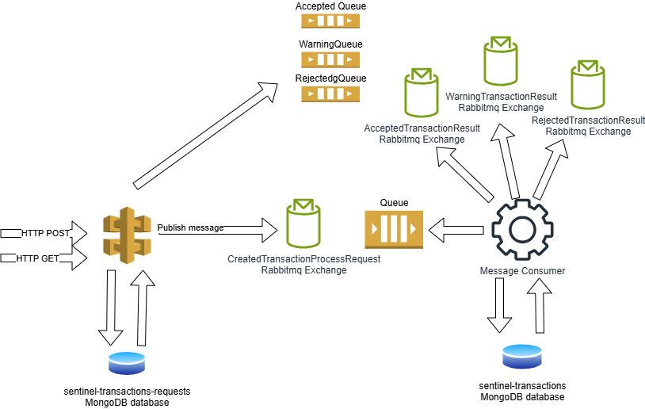

# Sentinel Project

## Overview

This application is designed to process financial transactions, evaluate their legitimacy using a rule-based engine, and notify the outcome.
It is split in two main pieces:
- ASPNET Core API to ingest the transaction and retrieve the process outcome
- Consumer hosted using MassTransit that implements the rule engine to process the transactions

## Architecture



### POST transaction to ASPNET API (SentinelProject.API project)
The entry point is the ASPNET Core API (on the left). This si built using Minimal API and [FastEndpoints](https://fast-endpoints.com/).

`HTTP POST /transactions` 
```json
{
  "transactionId": "3108928c-0d1c-48a1-8be0-c24d75ee57cc",
  "userId": "f36cf87b-a1e4-46f2-9f05-934a1b171b2f",
  "amount": 10,
  "location": "Italy",
  "merchant": "Amazon",
  "device": "Mobile",
  "transactionType": "Purchase",
  "issuedAt": "2024-11-24T16:02:54.270Z"
}
```

The API endpoint:
1. stores the transaction in its database in a record with status `Processing`
2. publish a `CreatedTransactionProcessRequest`message to the RabbitMQ bus
3. returns an HTTP 202 Accepted response to signal that the processing has started and in the `location` header there is the address from where the client can check the status of the processing doing HTTP GET i.e. `https://localhost:7140/transactions/67431d5833103bceb7deb9bc`

> [!NOTE]
> This endpoint performs a very basic validation of the incoming message by checking that the transaction amount is greather than zero.


### Message Consumer  (SentinelProject.Consumer project)

This uses MassTransit to attach a queue to the `CreatedTransactionProcessRequest` exchange and pools the messages that are published.

For each message, it applies some business rules to understand if the transacion is:
- fraudulent and then should be Rejected (status Rejected)
- valid but should be manually checked (status Warning)
- valid and then should be Accepted (status Accepted)

The engine then publishes the resulting message to the corresponding RabbitMQ exchange:
- Rejected -> RejectedTransactionResult
- Warning -> WarningTransactionResult
- Accepted -> AcceptedTransactionResult

As last step, for accepted transactions, the consumer also stores the transaction into its database (`sentinel-transactions`) to build the transactions history for the customer.

### ASPNET API update status
The ASPNET API also uses MassTransit to consume the outcome of the transaction processing.
In particular, for each outcome, it updates the status of the transaction in its database.

This allows the client to check the status of the processing operation.

## Rule engine
At this stage, the rule engine is entirely used by the Message Consumer and it comprises of three rule.

### Hostile coutry
Verify that the location of the transaction belong to a trusted country.

There are three types of countries and for each, there is a different trust rate:
- Hostile country, trust rate below 0.3 - Transaction **Rejected**
- Medium trust country, trust rate between 0.3 and 0.5 - Transaction **Warning**
- Trusted country, trust rate greater than 0.5 - Transaction **Accepted**

### Customer Settings
Each customer has a maximum transaction amount that is allowed.
When the transaction amount exceeds this value, the transaction is **Rejected**.

### Subsequent small transactions
This is to check subsequent possible fraudulent transaction patterns
- When there are many (10) small (amount <= 5) subsequent transactions each within 1 minute of the other, It is accepted with **Warning**
- When there are many (10) not small (at least one > 5) subsequent transactions each within 1 minute of the other, It is **Accepted**

### Structure
Each rule is coded as a single component and implements a specific interface.
It is possible to implement and test each new rule in isolation.

Any additional consideration on the order of exection of the rules can be done when registering the rule set cia dependency injection. Some rules could also run in parallel.

In case of very intense workloads, it is possible to extract every single rule or combination of them, in separate microservices and have some kind of orchestrator that deals with the status of the workflow.

### Machine Learning
This implementation does not rely on any ML model. However, there are at least various alternatives:
- using a cloud provider managed service. Both AWS and Azure have a set of services that implement fraud detection
- hosting the model and dealing with making it available to the rule engine

Also, not strictly related to ML is Vector Search. This could be tested to understand if a transaction fits the customer's habits.

## Authentication
The access to the API's endpoint is allowed only to request that provides the expected API key in the `x-api-key` header.
Validation is performed by matching the value in the header with the one on the API's configuration file.

FastEndpoints have authentication ON  by default and they relays on ASPNET COre authorization schemas.

## Tests
In the source code there is a test project that covers the business logic implementation for the rule engine.

Other than that, there are some tests for the POST endpoint validator.

Integration tests are missing. However, using [Testcontainers](https://dotnet.testcontainers.org/) for the external dependencies and [TestServer](https://learn.microsoft.com/en-us/aspnet/core/test/integration-tests), it is possible to cover also the integration between the different components.

MassTransit provides the test harness to have a running in-memory instance. However, with Testcontainers it is already possible to have a RabbitMQ container running on the local machine.

## Improvements
This version is not optimized for significant load of transactions.

### Cache
A layer of cache should be added to the component that retrieves the list of countries.
It is unlikely for this information to change frequently.

The HTTP GET that returns the status of the transaction process could also be cached.

### API
If there is no control over who is the final user of the API, it is necessary to add throttling control, so that the load does not risk bringing the service down.

### Observability
Add OpenTelemetry.

### Security
Encrypt messages.

## Run local
To run the solution in the local machine it is necessary to have RabbitMQ and MongoDB running.

These can be used by using docker-compose. In the root folder there is a docker-compose file.
This has also the port mapping for the default configuration.

It would be possible to access to:

- MongoDB using `mongodb://localhost:27017/?directConnection=true` as connection string
- RabbitMQ UI browsing `http://localhost:15672/#/` and login usin username: guest password: guest

When the consumer starts, it creates some database indexes and also adds some default test data.

### Countries

|name|trustRate|
|----|---------|
|Trusted Country|1|
|Medium Trust Country|0.4|
|Hostile Country|0.1|

### Customers

|customerId|name|maxTransactionAmount|
|----------|----|--------------------|
|f2887467-a266-4554-9b8c-51d8e52c7771|Paolo Rossi|100|
|819af267-9ac2-4121-85d1-5bf6eab0cb25|Mario Verdi|520|
|d4620576-783d-4a64-bf68-1f386ccfeb14|Franco Romano|50|

Run:
- `SentinelProject.API project`
- `SentinelProject.Consumer project`

The `SentinelProject.ClientConsole` can be used to simulate invocations to the API.